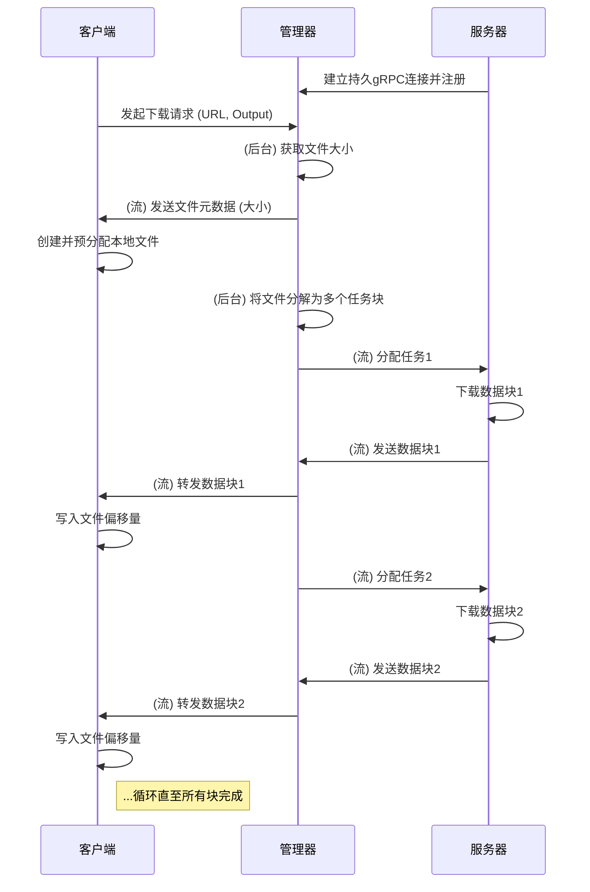

# 分布式下载器 (Rust 版本)

一个用 Rust 编写的高性能、基于 gRPC 的分布式文件下载器。该项目通过将下载任务动态分发到多个工作节点来加速大文件的下载过程。


## 特性

- **分布式架构**：采用 Manager-Server-Client 架构，通过 gRPC 实现高效、健壮的通信。
- **持久连接**：Server 节点与 Manager 建立持久的双向 gRPC 流，用于注册和实时任务分发。
- **流式数据传输**：下载的数据块通过流式 RPC 从 Server -> Manager -> Client 进行转发，高效且节省内存。
- **动态任务分配**：Manager 将大文件切割为不大于 3MB 的标准块，并以轮询方式动态分配给所有可用的 Server 节点。
- **配置管理**：基于 YAML 的清晰配置文件。
- **错误处理**：全面的错误处理和日志记录。
- **跨平台**：支持 Windows、macOS 和 Linux。
- **高性能**：使用 Rust 和 Tokio 构建，确保内存安全和高并发性能。

## 架构

系统由三个主要组件构成：

1.  **Manager (管理器)**：中央协调节点。它不直接参与下载，而是负责：
    *   接收和管理所有 Server 节点的长连接。
    *   接收 Client 的下载请求。
    *   获取文件元数据（如大小），并将其分解为多个小的下载任务。
    *   将下载任务动态分配给已连接的 Server。
    *   接收 Server 下载好的数据块，并将其准确地转发给对应的 Client。

2.  **Server (服务器/工作节点)**：实际执行下载的节点。可以水平扩展（即同时运行多个）。它的职责是：
    *   启动时主动连接到 Manager，并注册自己。
    *   在持久的 gRPC 流上等待 Manager 分配下载任务。
    *   根据任务指令（URL 和字节范围），下载文件分块到内存中。
    *   将下载好的数据块通过 gRPC 流回传给 Manager。

3.  **Client (客户端)**：用户工具，用于发起下载。它的职责是：
    *   向 Manager 发送一次性的下载请求（包含 URL 和输出文件名）。
    *   与 Manager 建立一个数据流连接，并保持存活。
    *   首先接收 Manager 发来的文件元数据，并创建本地空文件。
    *   持续接收 Manager 转发来的数据块，并根据偏移量写入文件的正确位置，直到下载完成。

### 系统工作流程




## 安装

### 先决条件

- Rust 1.56或更高版本
- Cargo包管理器

### 从源码构建

```bash
git clone https://github.com/your-username/distributed-downloader.git
cd distributed-downloader
cargo build --release
```

## 使用方法

### 1. 配置组件

根据 `configs/` 目录中的示例创建每个组件的配置文件：

- `configs/manager.yml`：管理器配置
- `configs/server.yml`：服务器配置
- `configs/client.yml`：客户端配置

### 2. 启动管理器

在一个终端中启动 Manager：
```bash
./target/release/manager --config configs/manager.yml
```

### 3. 启动服务器

根据需要，在一个或多个终端中启动 Server 节点：
```bash
# 启动第一个 Server
./target/release/server --config configs/server.yml

# 启动更多 Server...
./target/release/server --config configs/server.yml
```
您可以启动多个 Server 实例以提高下载速度。

### 4. 启动客户端下载

在另一个终端中，使用 Client 发起下载：
```bash
./target/release/client <URL> -o <OUTPUT_FILE_PATH>
```

**示例**:
```bash
./target/release/client "https://releases.ubuntu.com/22.04.1/ubuntu-22.04.1-desktop-amd64.iso" -o "ubuntu.iso"
```

将 `<URL>` 替换为您要下载的文件URL，`<OUTPUT_FILE_PATH>` 替换为您希望保存的文件路径。

## 配置

### Manager 配置 (`manager.yml`)

```yaml
# Manager 监听的 IP 地址和端口
manager_addr_ipv4: 127.0.0.1
manager_port: 5000
```

### Server 配置 (`server.yml`)

```yaml
# 要连接的 Manager 的 IP 地址和端口
manager_addr_ipv4: 127.0.0.1
manager_port: 5000

# Server 用于存储临时文件的目录 (当前版本未使用)
tmp_dir: ./ddr-download/server/tmp/
# 最终文件存放目录 (当前版本未使用)
target_dir: ./ddr-download/server/target/
```

### Client 配置 (`client.yml`)

```yaml
# 要连接的 Manager 的 IP 地址和端口
manager_addr_ipv4: 127.0.0.1
manager_port: 5000
```

## 技术栈

- **语言**: Rust
- **异步运行时**: Tokio
- **网络通信**: gRPC / Tonic / Protobuf
- **HTTP客户端**: reqwest
- **序列化**: serde (YAML)
- **命令行解析**: clap
- **日志**: tracing
- **进度显示**: indicatif

## 已知限制

1. 当前实现仅支持HTTP/HTTPS协议。
2. 暂不支持断点续传功能。
3. 缺少图形用户界面。

## 未来改进

1. 添加对FTP等其他协议的支持。
2. 实现完整的断点续传功能（在 Client 和 Manager 端记录进度）。
3. 开发图形用户界面。
4. 增加更多配置选项，如动态调整块大小。
5. 改进错误处理和恢复机制（例如，如果一个 Server 失败，重新分配其任务）。
