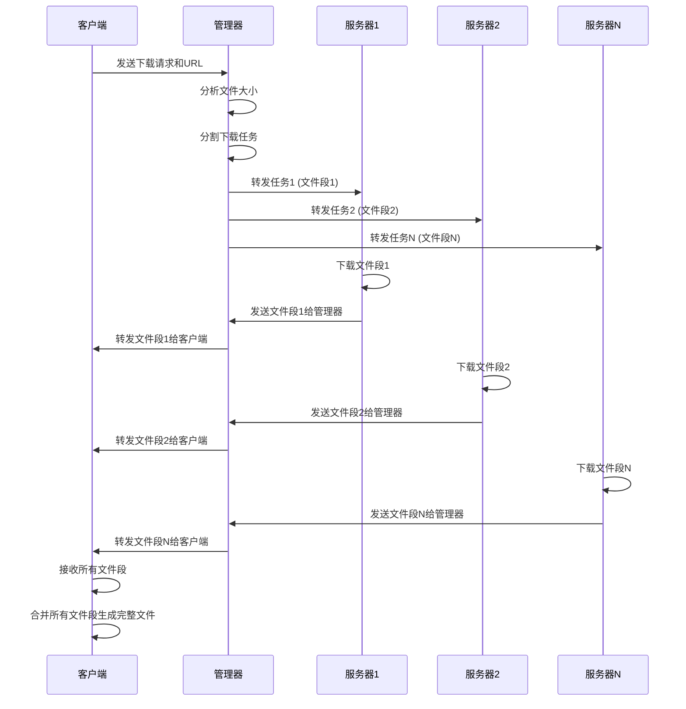
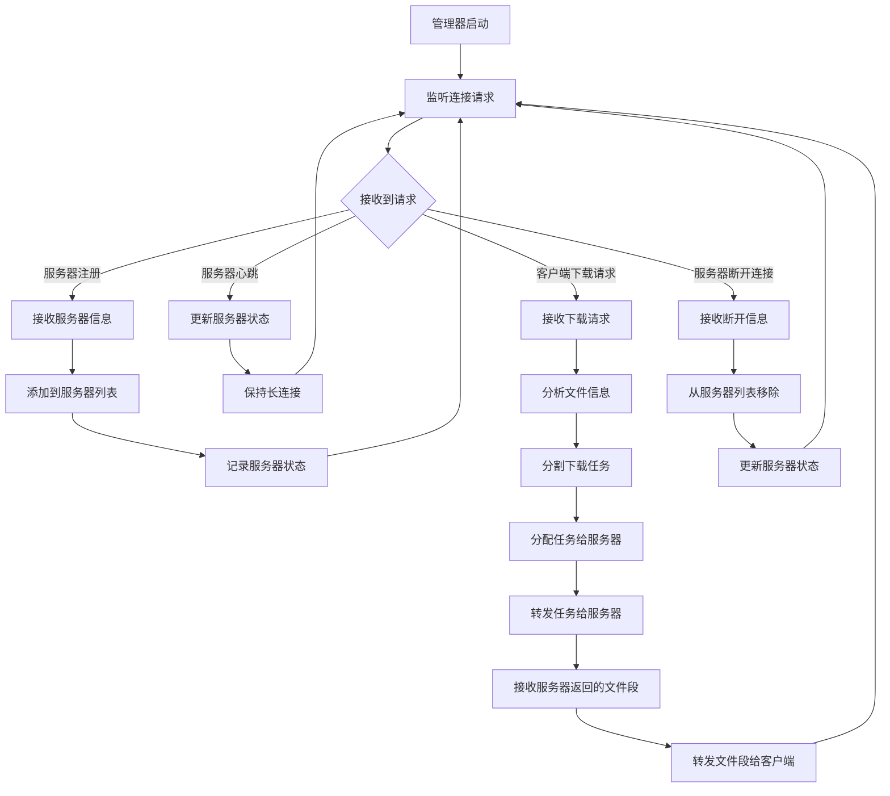
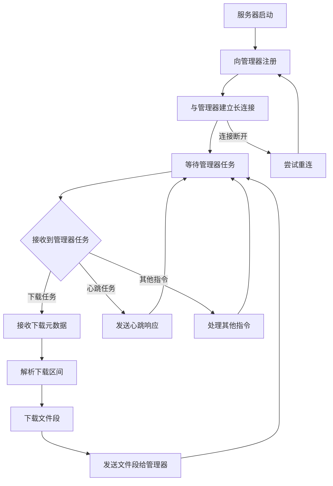

# 分布式下载器 (Rust版本)

一个用Rust编写的高性能分布式文件下载器。该项目通过将工作负载分布到多个服务器来加速文件下载。

## 特性

- **分布式架构**：采用管理器-服务器-客户端架构实现高效文件下载
- **多线程下载**：每个服务器可以使用多个线程下载文件片段
- **范围请求**：支持HTTP范围请求以实现高效的分段下载
- **进度跟踪**：为下载提供可视化进度条
- **配置管理**：基于YAML的配置文件
- **错误处理**：全面的错误处理和日志记录
- **跨平台**：支持Windows、macOS和Linux
- **高性能**：使用Rust构建，确保内存安全和性能

## 架构

系统由三个主要组件组成：

1. **管理器**：中央协调器，维护可用服务器列表，并代理客户端与服务器之间的所有通信
2. **服务器**：下载节点，实际下载文件片段，与管理器保持长连接以接收任务
3. **客户端**：启动下载并向管理器发送下载请求

## 系统工作流程

```
1. 启动管理器
   ↓
2. 启动服务器（向管理器注册并保持长连接）
   ↓
3. 客户端向管理器发送下载请求
   ↓
4. 管理器分割下载任务并分发给服务器
   ↓
5. 服务器下载文件段并通过管理器返回给客户端
   ↓
6. 客户端通过管理器接收所有文件段并合并生成完整文件
```

## 下载请求处理流程

### 客户端发起下载请求时的处理流程

当客户端发起下载请求时，管理器和服务器会按照以下步骤进行处理：



### 管理器处理流程



### 服务器处理流程



## 安装

### 先决条件

- Rust 1.56或更高版本
- Cargo包管理器

### 从源码构建

```bash
git clone <repository-url>
cd distributed-downloader
cargo build --release
```

## 使用方法

### 1. 配置组件

根据`configs/`目录中的示例创建每个组件的配置文件：

- `configs/manager.yml`：管理器配置
- `configs/server.yml`：服务器配置
- `configs/client.yml`：客户端配置

### 2. 启动管理器

```bash
./target/release/manager --config configs/manager.yml
```

### 3. 启动服务器

```bash
./target/release/server --config configs/server.yml
```

您可以启动多个服务器以提高下载速度。

### 4. 启动客户端

```bash
./target/release/client --config configs/client.yml <URL>
```

将`<URL>`替换为您要下载的文件URL。

## 配置

### 管理器配置

```yaml
manager_addr_ipv4: 127.0.0.1
manager_port: 5000
```

### 服务器配置

```yaml
manager_addr_ipv4: 127.0.0.1
manager_port: 5000
tmp_dir: ./ddr-download/server/tmp/
threads_num: 4
target_dir: ./ddr-download/server/target/
```

### 客户端配置

```yaml
manager_addr_ipv4: 127.0.0.1
manager_port: 5000
tmp_dir: ./ddr-download/client/tmp/
target_dir: ./ddr-download/client/target/
```

## 调试
下载测试文件 `https://httpbin.org/json`
```bash
cargo run --bin manager -- --config configs/manager.yml
cargo run --bin server -- --config configs/server.yml
cargo run --bin client -- https://httpbin.org/json --config configs/client.yml
```

## 构建和运行测试

### 单元测试

```bash
cargo test
```

### 集成测试

```bash
cargo test --test integration_tests
```

## 项目结构

```
distributed-downloader/
├── src/
│   ├── lib.rs
│   ├── bin/
│   │   ├── manager.rs
│   │   ├── server.rs
│   │   └── client.rs
│   ├── config/
│   ├── network/
│   ├── downloader/
│   ├── utils/
│   └── error/
├── configs/
├── tests/
└── Cargo.toml
```

## 技术栈

- **语言**: Rust
- **异步运行时**: Tokio
- **HTTP客户端**: reqwest
- **序列化**: serde (JSON, YAML)
- **命令行解析**: clap
- **日志**: tracing
- **进度显示**: indicatif
- **测试**: tokio-test, assert_fs

## 已知限制

1. 当前实现仅支持HTTP/HTTPS协议
2. 服务器端的多线程下载功能在某些服务器上可能不可用
3. 暂不支持断点续传功能
4. 缺少图形用户界面

## 未来改进

1. 添加对FTP等其他协议的支持
2. 实现完整的断点续传功能
3. 开发图形用户界面
4. 增加更多配置选项
5. 改进错误处理和恢复机制